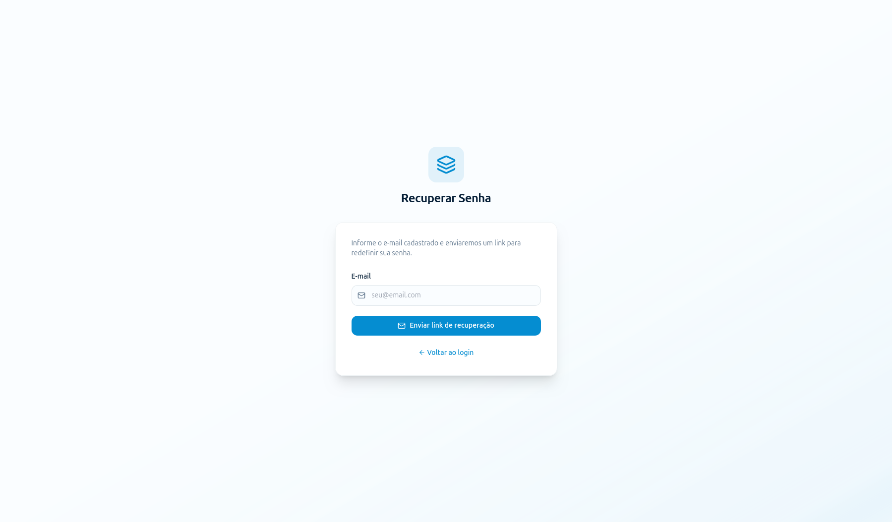

# SGES
## Especificação de Caso de Uso: CSU02 (RF02) - Redefinir senha de acesso

[Matriz de Priorização](../../matriz_de_acao_e_priorizacao.md)  
[Andamento](../andamento.md)  
[Cronograma e Planejamento](../../cronograma_e_entregas.md#tabela-de-cronograma-e-planejamento)

---

### 1. Breve Descrição
Permitir ao usuário a recuperação do acesso ao sistema mediante o envio de um link seguro com token temporário de redefinição de senha.

---

### 2. Fluxo Básico de Eventos
1. O usuário acessa a página de login do SGES e clica em 'Esqueci minha senha'.
2. O sistema solicita o e-mail cadastrado do usuário.
3. O usuário informa o e-mail e clica em 'Enviar'.
4. O sistema valida se o e-mail informado pertence a uma conta ativa. [[FE-4-A](#fe-4-a-e-mail-nao-cadastrado), [FE-4-B](#fe-4-b-dados-invalidos-e-mail), [FE-4-C](#fe-4-c-falha-de-persistencia-envio)]
5. O sistema gera um token temporário com validade de 15 minutos.
6. O sistema envia um e-mail contendo o link seguro de redefinição com o token em até 1 minuto.
7. O usuário acessa o link seguro através do e-mail recebido e é direcionado para a tela de criação de nova senha. [[FE-7-A](#fe-7-a-linktoken-expirado), [FE-7-B](#fe-7-b-linktoken-invalido)]
8. O usuário insere a nova senha, confirma e clica em 'Salvar'.
9. O sistema valida as diretrizes de segurança da nova senha e a armazena de forma criptografada. [[FE-9-A](#fe-9-a-dados-invalidos-senha), [FE-9-B](#fe-9-b-falha-de-persistencia-gravacao)]
10. O sistema invalida o token de redefinição e redireciona o usuário para a tela de login.

---

### 3. Fluxos Alternativos
Não há fluxos alternativos identificados.

---

### 4. Fluxos de Exceção
#### FE-4-A - E-mail não Cadastrado
No passo 4, se o e-mail não estiver cadastrado no sistema, para evitar a varredura e descoberta de usuários legítimos, o sistema exibe a mesma mensagem de sucesso padrão (que um link foi enviado se o e-mail existir), mas não dispara nenhuma mensagem eletrônica.

#### FE-4-B - Dados Inválidos (E-mail)
No passo 4, se o formato do e-mail fornecido for inválido, o sistema bloqueia o envio, exibe um alerta de validação de formato e solicita a correção.

#### FE-4-C - Falha de Persistência (Envio)
No passo 4, se houver falha de rede/comunicação com a base de dados ou com o servidor de envio de e-mails, o sistema impede a operação e exibe um alerta de indisponibilidade de serviço.

#### FE-7-A - Link/Token Expirado
No passo 7, se o usuário tentar redefinir a senha utilizando um link cujo token já expirou (mais de 15 minutos desde o envio), o sistema impede a ação e exibe uma mensagem de erro orientando a realizar uma nova solicitação.

#### FE-7-B - Link/Token Inválido
No passo 7, se o usuário tentar redefinir a senha utilizando um link cujo token é inválido (formato incorreto, adulterado ou inexistente), o sistema impede a ação e exibe uma mensagem de erro orientando a realizar uma nova solicitação.

#### FE-9-A - Dados Inválidos (Senha)
No passo 9, se a nova senha informada não cumprir os requisitos mínimos de segurança (ex: menos de 4 caracteres), o sistema bloqueia a gravação e apresenta um alerta descrevendo a falha na diretriz de senhas.

#### FE-9-B - Falha de Persistência (Gravação)
No passo 9, se houver uma falha de conexão com a base de dados no momento da gravação da senha, o sistema bloqueia a ação, exibe uma mensagem de erro de gravação e mantém os dados anteriores.

---

### 5. Pré-Condições
* O usuário deve possuir uma conta ativa associada ao e-mail informado.

---

### 6. Pós-Condições
* A senha do usuário é atualizada de forma segura no banco de dados e o token temporário utilizado é invalidado.

---

### 7. Pontos de Extensão
Nenhum ponto de extensão identificado.

---

### 8. Requisitos Especiais
* RNF01 - Criptografia Sensível: A nova senha deve ser hasheada de forma segura antes de ser persistida no banco de dados.
* Envio do e-mail em até 1 minuto após a solicitação.

---

### 9. Informações Adicionais

#### Protótipo de Tela (DoR)

{: style="border-radius: 8px; box-shadow: 0 4px 16px rgba(0,0,0,0.08); max-width: 100%; border: 1px solid var(--sges-card-border); margin-top: 1rem;"}
