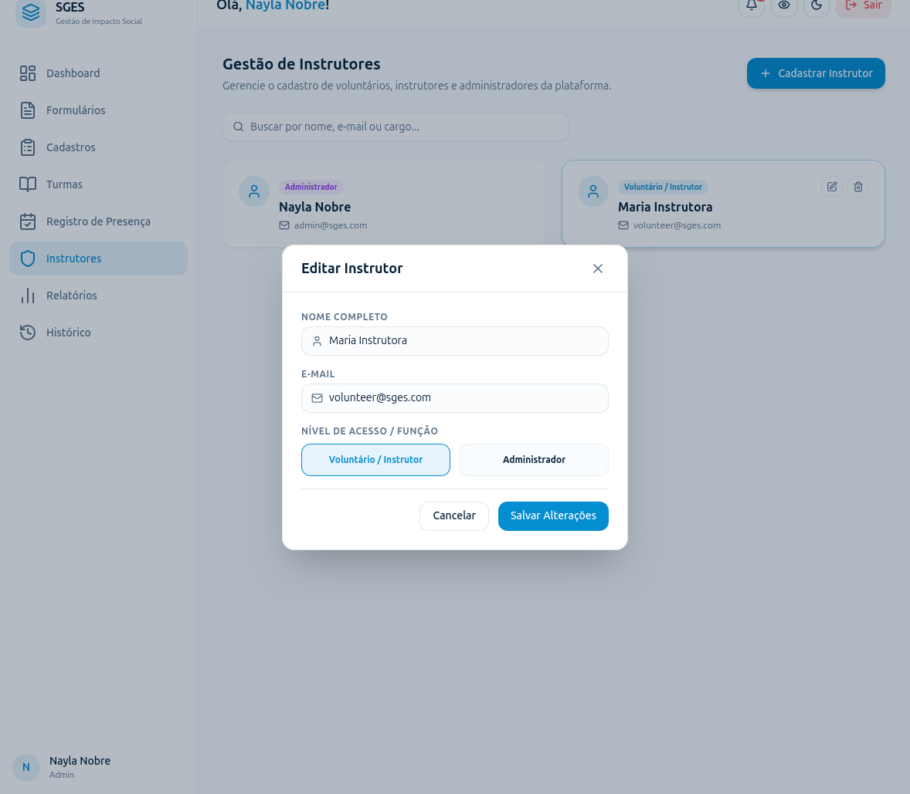

# SGES
## Especificação de Caso de Uso: CSU05 (RF05) - Editar perfil do instrutor

[Matriz de Priorização](../../matriz_de_acao_e_priorizacao.md)  
[Andamento](../andamento.md)  
[Cronograma e Planejamento](../../cronograma_e_entregas.md#tabela-de-cronograma-e-planejamento)

---

### 1. Breve Descrição
Permitir a edição das informações de contato e a atualização das permissões de acesso associadas ao instrutor.

---

### 2. Fluxo Básico de Eventos
1. O Gestor acessa a lista de instrutores [[FA-1-A](#fa-1-a-lista-vazia), [FE-1-B](#fe-1-b-permissao-insuficiente)] e seleciona o instrutor que deseja editar. [[FE-1-C](#fe-1-c-item-inexistente)]
2. O sistema exibe os dados atuais do instrutor no formulário (Foto, Nome Completo, CPF, E-mail, Telefone, Endereço, Profissão, Perfil de Acesso, Contato de Emergência [Nome/Telefone] e Atividades de semestres anteriores).
3. O Gestor edita os campos necessários e clica em 'Salvar Alterações'.
4. O sistema valida a conformidade dos dados e a unicidade do CPF/E-mail (se alterados). [[FE-4-A](#fe-4-a-formato-de-dados-invalido), [FE-4-B](#fe-4-b-e-mail-ja-em-uso), [FE-4-C](#fe-4-c-cpf-ja-em-uso)]
5. O sistema salva as atualizações no banco de dados. [[FE-5-A](#fe-5-a-falha-de-persistencia)]
6. O sistema exibe uma mensagem de sucesso e atualiza imediatamente as permissões ativas do instrutor.

---

### 3. Fluxos Alternativos
#### FA-1-A - Lista Vazia
No passo 1, se não houver instrutores cadastrados no sistema, o sistema exibe uma mensagem informativa de estado vazio, orientando a cadastrar o primeiro instrutor.

---

### 4. Fluxos de Exceção
#### FE-1-B - Permissão Insuficiente
No passo 1, se o usuário logado não for um Gestor administrador, o sistema bloqueia o acesso à listagem e ao formulário de edição de terceiros, retornando uma mensagem de erro de acesso não autorizado.

#### FE-1-C - Item Inexistente
No passo 1, se o instrutor selecionado para edição não for encontrado na base de dados (ex: por exclusão simultânea), o sistema cancela a operação, exibe uma mensagem informando que o instrutor não existe e recarrega a lista.

#### FE-4-A - Formato de Dados Inválido
No passo 4, se os dados inseridos violarem as regras de formato do sistema, o sistema exibe mensagens de erro de validação e mantém as informações anteriores.

#### FE-4-B - E-mail já em Uso
No passo 4, se o e-mail informado já estiver cadastrado para outro usuário, o sistema impede o salvamento, exibe mensagem de erro de duplicidade e mantém as informações anteriores.

#### FE-4-C - CPF já em Uso
No passo 4, se o CPF informado já estiver cadastrado para outro instrutor, o sistema impede o salvamento, exibe mensagem de erro de duplicidade e mantém as informações anteriores.

#### FE-5-A - Falha de Persistência
No passo 5, se houver falha de conexão com a base de dados durante o salvamento das modificações, o sistema bloqueia a ação, exibe um alerta de indisponibilidade de banco de dados e mantém os dados na tela.

---

### 5. Pré-Condições
* O Gestor está autenticado e o instrutor a ser editado já existe no sistema.

---

### 6. Pós-Condições
* As alterações cadastrais e as novas permissões do instrutor são salvas no banco de dados e entram em vigor imediatamente.

---

### 7. Pontos de Extensão
Nenhum ponto de extensão identificado.

---

### 8. Requisitos Especiais
* RNF02 - Trilha de Auditoria: Modificações de dados de perfis de instrutores devem ser registradas na tabela de logs para fins de auditoria.

---

### 9. Informações Adicionais

#### Protótipo de Tela (DoR)

{: style="border-radius: 8px; box-shadow: 0 4px 16px rgba(0,0,0,0.08); max-width: 100%; border: 1px solid var(--sges-card-border); margin-top: 1rem; margin-bottom: 1rem;"}

{: style="border-radius: 8px; box-shadow: 0 4px 16px rgba(0,0,0,0.08); max-width: 100%; border: 1px solid var(--sges-card-border); margin-top: 1rem;"}
