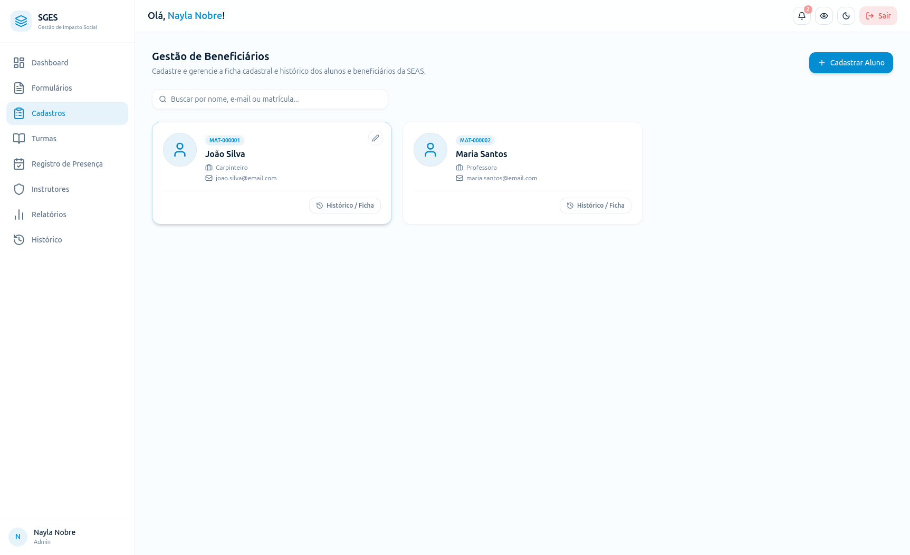
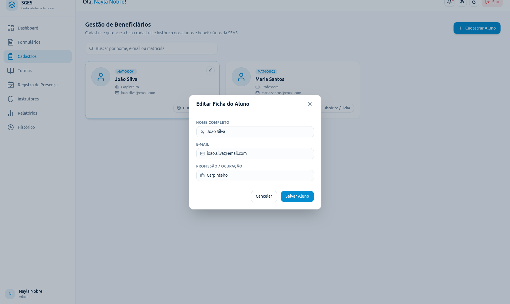

# SGES
## Especificação de Caso de Uso: CSU07 (RF08) - Editar dados do beneficiário

[Matriz de Priorização](../../matriz_de_acao_e_priorizacao.md)  
[Andamento](../andamento.md)  
[Cronograma e Planejamento](../../cronograma_e_entregas.md#tabela-de-cronograma-e-planejamento)

---

### 1. Breve Descrição
Atualizar os dados cadastrais e as informações de contato do beneficiário no sistema.

---

### 2. Fluxo Básico de Eventos
1. O usuário busca pelo beneficiário desejado no sistema [[FA-1-A](#fa-1-a-lista-vazia), [FE-1-B](#fe-1-b-permissao-insuficiente)] e abre sua ficha cadastral. [[FE-1-C](#fe-1-c-item-inexistente)]
2. O usuário edita os campos necessários no formulário (Foto, Nome Completo, Telefone, E-mail, Endereço, Profissão, Contato de Emergência [Nome e Telefone], CPF, Contato Responsável).
3. O usuário clica em 'Salvar'.
4. O sistema valida a conformidade das informações atualizadas. [[FE-4-A](#fe-4-a-remocao-de-informacao-obrigatoria), [FE-4-B](#fe-4-b-formato-de-dados-incorreto), [FE-4-C](#fe-4-c-cpf-ja-em-uso-duplicidade), [FE-4-D](#fe-4-d-e-mail-ja-em-uso-duplicidade)]
5. O sistema persiste os novos dados na base de dados. [[FE-5-A](#fe-5-a-falha-de-persistencia)]
6. O sistema exibe mensagem de sucesso e atualiza a exibição com os dados modificados.

---

### 3. Fluxos Alternativos
#### FA-1-A - Lista Vazia
No passo 1, se o sistema não possuir beneficiários cadastrados ou se a busca realizada não retornar nenhum registro, o sistema exibe uma mensagem informativa de busca vazia ("Nenhum beneficiário encontrado").

---

### 4. Fluxos de Exceção
#### FE-1-B - Permissão Insuficiente
No passo 1, se o usuário logado não possuir privilégios autorizados para editar registros, o sistema impede o carregamento da ficha cadastral e retorna mensagem de erro de permissão insuficiente.

#### FE-1-C - Item Inexistente
No passo 1, se o beneficiário selecionado para edição não for encontrado na base de dados (deletado por outro usuário), o sistema exibe a mensagem de erro "Beneficiário não encontrado" e recarrega a listagem.

#### FE-4-A - Remoção de Informação Obrigatória
No passo 4, se alguma informação obrigatória for removida deixando o campo em branco, o sistema impede o salvamento e solicita o preenchimento.

#### FE-4-B - Formato de Dados Incorreto
No passo 4, se forem adicionados dados em formatos incorretos (ex: e-mail inválido), o sistema impede o salvamento e solicita a correção.

#### FE-4-C - CPF já em Uso (Duplicidade)
No passo 4, se o CPF atualizado já estiver cadastrado para outro beneficiário na base de dados, o sistema impede o salvamento, exibe mensagem de erro de duplicidade e solicita a correção.

#### FE-4-D - E-mail já em Uso (Duplicidade)
No passo 4, se o e-mail atualizado já estiver cadastrado para outro beneficiário na base de dados, o sistema impede o salvamento, exibe mensagem de erro de duplicidade e solicita a correção.

#### FE-5-A - Falha de Persistência
No passo 5, se ocorrer um erro de conexão com a base de dados ao persistir os dados, o sistema impede a operação, exibe mensagem de erro de persistência de dados e mantém as alterações no formulário.

---

### 5. Pré-Condições
* O usuário está autenticado e o beneficiário a ser editado já se encontra registrado no sistema.

---

### 6. Pós-Condições
* Os novos dados cadastrais e de contato do beneficiário são consolidados e atualizados na base de dados.

---

### 7. Pontos de Extensão
Nenhum ponto de extensão identificado.

---

### 8. Requisitos Especiais
* RNF01 - Criptografia Sensível: Manter a criptografia e a segurança no armazenamento das informações após a alteração.

---

### 9. Informações Adicionais

#### Protótipo de Tela (DoR)

{: style="border-radius: 8px; box-shadow: 0 4px 16px rgba(0,0,0,0.08); max-width: 100%; border: 1px solid var(--sges-card-border); margin-top: 1rem; margin-bottom: 1rem;"}

{: style="border-radius: 8px; box-shadow: 0 4px 16px rgba(0,0,0,0.08); max-width: 100%; border: 1px solid var(--sges-card-border); margin-top: 1rem;"}
