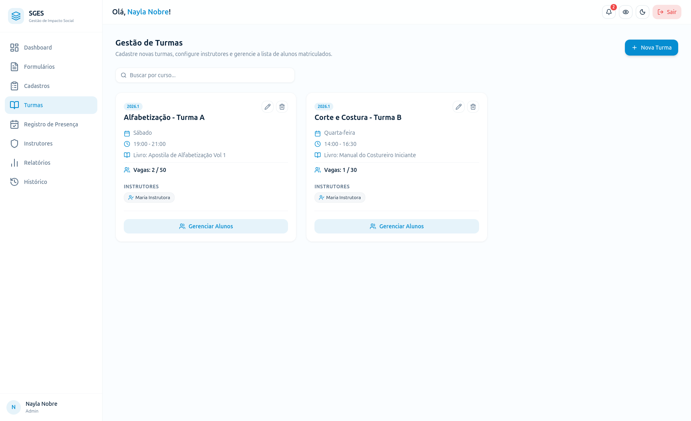
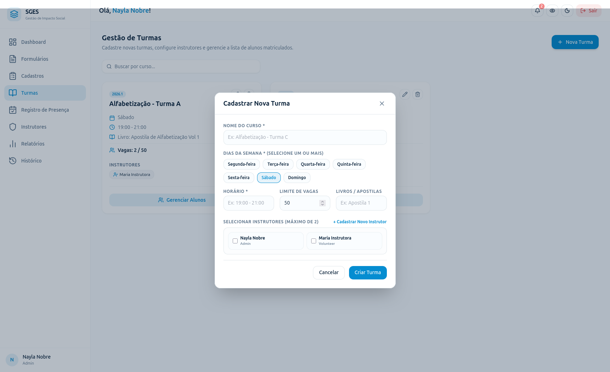

# SGES
## Especificação de Caso de Uso: CSU08 (RF09) - Cadastrar Turma

[Matriz de Priorização](../../matriz_de_acao_e_priorizacao.md)  
[Andamento](../andamento.md)  
[Cronograma e Planejamento](../../cronograma_e_entregas.md#tabela-de-cronograma-e-planejamento)

---

### 1. Breve Descrição
Registrar uma nova turma associada a uma oficina, definindo datas de início e término, horários, limite de vagas e o instrutor responsável.

---

### 2. Fluxo Básico de Eventos
1. O Gestor acessa a seção de oficinas/turmas [[FE-1-A](#fe-1-a-permissao-insuficiente)] e clica em 'Cadastrar Turma'.
2. O sistema exibe o formulário solicitando: Nome da Oficina, Data de Início, Data de Término, Dias da Semana/Horários, Limite de Vagas e Instrutor Responsável.
3. O Gestor preenche as informações e clica em 'Salvar'.
4. O sistema realiza as validações de consistência: se a data de início é anterior à data de término, se o limite de vagas é um número inteiro positivo, se o instrutor está ativo, se todos os campos obrigatórios estão preenchidos e se a turma é única. [[FE-4-A](#fe-4-a-inconsistencia-de-datas), [FE-4-B](#fe-4-b-limite-de-vagas-invalido), [FE-4-C](#fe-4-c-instrutor-inativo), [FE-4-D](#fe-4-d-conflito-de-agenda-do-instrutor), [FE-4-E](#fe-4-e-dados-invalidos), [FE-4-F](#fe-4-f-duplicidade-de-turma)]
5. O sistema salva a nova turma na base de dados. [[FE-5-A](#fe-5-a-falha-de-persistencia)]
6. O sistema exibe mensagem de confirmação de cadastro e a disponibiliza no catálogo.

---

### 3. Fluxos Alternativos
Não há fluxos alternativos identificados.

---

### 4. Fluxos de Exceção
#### FE-1-A - Permissão Insuficiente
No passo 1, se o usuário logado não for um administrador ou gestor autorizado, o acesso à tela de cadastro é bloqueado e o sistema retorna erro de permissão insuficiente.

#### FE-4-A - Inconsistência de Datas
No passo 4, se a data de início da turma for posterior à data de término definida, o sistema emite um erro e impede o cadastro.

#### FE-4-B - Limite de Vagas Inválido
No passo 4, se o limite de vagas informado não for um número inteiro positivo, o sistema emite um erro e impede o cadastro.

#### FE-4-C - Instrutor Inativo
No passo 4, se o instrutor escolhido não estiver ativo, o sistema emite um alerta e solicita a escolha de outro profissional.

#### FE-4-D - Conflito de Agenda do Instrutor
No passo 4, se o instrutor escolhido já estiver alocado em outra turma ativa no mesmo dia e faixa de horário, o sistema emite um alerta e solicita a escolha de outro profissional ou horário.

#### FE-4-E - Dados Inválidos
No passo 4, se algum campo obrigatório (como Nome da Oficina) estiver em branco ou contiver caracteres inválidos, o sistema bloqueia a gravação e solicita preenchimento correto.

#### FE-4-F - Duplicidade de Turma
No passo 4, se o sistema identificar uma turma já existente com o mesmo nome da oficina, horários, dias da semana e semestre letivo, a criação é bloqueada para evitar duplicidade.

#### FE-5-A - Falha de Persistência
No passo 5, se houver erro ao salvar a nova turma no banco de dados, o sistema impede a gravação, exibe um alerta de erro de persistência de dados e mantém o formulário aberto com as informações digitadas.

---

### 5. Pré-Condições
* O Gestor deve estar autenticado e os instrutores que serão alocados devem estar cadastrados e ativos.

---

### 6. Pós-Condições
* A nova turma é cadastrada com sucesso e está apta a receber matrículas de beneficiários.

---

### 7. Pontos de Extensão
Nenhum ponto de extensão identificado.

---

### 8. Requisitos Especiais
* Garantir a flexibilidade de horários recorrentes (ex: turmas de terças e quintas).

---

### 9. Informações Adicionais

#### Protótipo de Tela (DoR)

{: style="border-radius: 8px; box-shadow: 0 4px 16px rgba(0,0,0,0.08); max-width: 100%; border: 1px solid var(--sges-card-border); margin-top: 1rem; margin-bottom: 1rem;"}

{: style="border-radius: 8px; box-shadow: 0 4px 16px rgba(0,0,0,0.08); max-width: 100%; border: 1px solid var(--sges-card-border); margin-top: 1rem;"}
