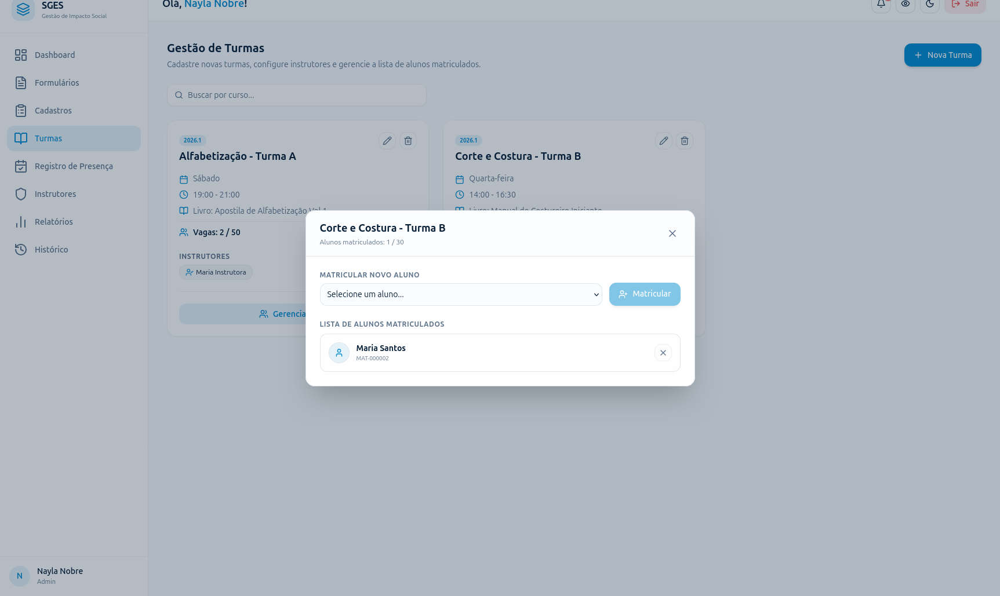

# SGES
## Especificação de Caso de Uso: CSU09 (RF10) - Matricular beneficiário

[Matriz de Priorização](../../matriz_de_acao_e_priorizacao.md)  
[Andamento](../andamento.md)  
[Cronograma e Planejamento](../../cronograma_e_entregas.md#tabela-de-cronograma-e-planejamento)

---

### 1. Breve Descrição
Vincular um beneficiário cadastrado e ativo a uma turma específica, realizando o abatimento das vagas disponíveis.

---

### 2. Fluxo Básico de Eventos
1. O usuário seleciona a turma desejada [[FE-1-A](#fe-1-a-turma-inexistente), [FE-1-B](#fe-1-b-permissao-insuficiente)] e clica na opção 'Matricular Aluno'.
2. O sistema apresenta um campo de busca para selecionar o beneficiário. [[FA-2-A](#fa-2-a-lista-de-beneficiarios-vazia)]
3. O usuário localiza o beneficiário ativo [[FE-3-A](#fe-3-a-beneficiario-inexistente)] e clica em 'Confirmar Matrícula'.
4. O sistema valida se o beneficiário já possui matrícula na turma e se a turma possui vagas em aberto. [[FE-4-A](#fe-4-a-limite-de-vagas-excedido), [FE-4-B](#fe-4-b-beneficiario-ja-matriculado)]
5. O sistema cria o registro de vínculo da matrícula e subtrai uma vaga disponível no limite da turma. [[FE-5-A](#fe-5-a-falha-de-persistencia)]
6. O sistema exibe mensagem de confirmação de matrícula efetuada com sucesso.

---

### 3. Fluxos Alternativos
#### FA-2-A - Lista de Beneficiários Vazia
No passo 2, se não houver beneficiários ativos cadastrados no sistema aptos para a matrícula, o sistema apresenta um aviso informando que a lista de beneficiários está vazia.

---

### 4. Fluxos de Exceção
#### FE-1-A - Turma Inexistente
No passo 1, se a turma selecionada não for encontrada na base de dados (ex: por exclusão simultânea), o sistema cancela a operação, exibe erro e retorna à listagem de turmas.

#### FE-1-B - Permissão Insuficiente
No passo 1, se o usuário logado não possuir papel que permita efetuar matrículas (ex: perfil não autorizado), o sistema bloqueia o acesso e exibe erro de permissão.

#### FE-3-A - Beneficiário Inexistente
No passo 3, se o beneficiário selecionado tiver sido deletado ou inativado simultaneamente no banco de dados, o sistema impede a confirmação e exibe erro de beneficiário inexistente.

#### FE-4-A - Limite de Vagas Excedido
No passo 4, se a turma não possuir vagas livres, o sistema bloqueia novas matrículas e emite um alerta informando que a turma está lotada.

#### FE-4-B - Beneficiário já Matriculado
No passo 4, se o beneficiário selecionado já possuir matrícula ativa na turma escolhida, o sistema cancela a operação e informa a duplicidade.

#### FE-5-A - Falha de Persistência
No passo 5, se ocorrer uma falha de conexão com a base de dados ao registrar o vínculo ou subtrair a vaga, o sistema reverte a transação, exibe uma mensagem de erro de gravação e mantém o estado anterior.

---

### 5. Pré-Condições
* O usuário deve estar autenticado; a turma e o beneficiário devem estar ativos.

---

### 6. Pós-Condições
* O vínculo de matrícula é criado no banco de dados e o saldo de vagas da turma é atualizado.

---

### 7. Pontos de Extensão
Nenhum ponto de extensão identificado.

---

### 8. Requisitos Especiais
* Atualização atômica do saldo de vagas para evitar problemas de concorrência caso dois usuários tentem matricular simultaneamente na última vaga.

---

### 9. Informações Adicionais

#### Protótipo de Tela (DoR)

{: style="border-radius: 8px; box-shadow: 0 4px 16px rgba(0,0,0,0.08); max-width: 100%; border: 1px solid var(--sges-card-border); margin-top: 1rem;"}
