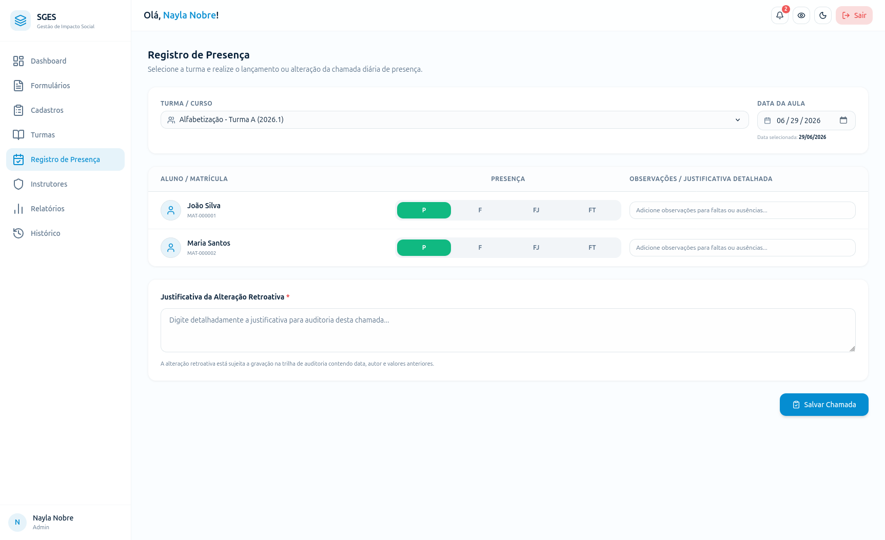

# SGES
## Especificação de Caso de Uso: CSU10 (RF12) - Alterar registro de frequência

[Matriz de Priorização](../../matriz_de_acao_e_priorizacao.md)  
[Andamento](../andamento.md)  
[Cronograma e Planejamento](../../cronograma_e_entregas.md#tabela-de-cronograma-e-planejamento)

---

### 1. Breve Descrição
Permitir ao Gestor a correção retroativa de faltas ou presenças já salvas, respeitando o limite temporal de 72 horas após a ocorrência da aula.

---

### 2. Fluxo Básico de Eventos
1. O Gestor acessa o diário de classe de uma turma [[FA-1-A](#fa-1-a-historico-de-aulas-vazio), [FE-1-B](#fe-1-b-permissao-insuficiente)] e seleciona uma aula passada para edição. [[FE-1-C](#fe-1-c-aula-inexistente)]
2. O sistema valida se o prazo de 72 horas a partir da data de ocorrência da aula ainda não expirou. [[FE-2-A](#fe-2-a-prazo-de-72-horas-excedido)]
3. O Gestor altera o registro de presença/falta de um ou mais beneficiários.
4. O Gestor digita obrigatoriamente a justificativa para a alteração retroativa.
5. O Gestor clica em 'Salvar Alterações'. [[FE-5-A](#fe-5-a-justificativa-nao-informada), [FE-5-B](#fe-5-b-dados-invalidos)]
6. O sistema persiste a alteração de frequência e a justificativa para auditoria no banco de dados. [[FE-6-A](#fe-6-a-falha-de-persistencia)]
7. O sistema exibe uma mensagem de confirmação de alteração efetuada.

---

### 3. Fluxos Alternativos
#### FA-1-A - Histórico de Aulas Vazio
No passo 1, se a turma selecionada não tiver nenhuma aula ou chamada cadastrada em seu histórico, o sistema exibe uma mensagem de estado vazio informando "Nenhuma chamada registrada anteriormente nesta turma".

---

### 4. Fluxos de Exceção
#### FE-1-B - Permissão Insuficiente
No passo 1, se o usuário ativo não tiver perfil de Gestor autorizado, o sistema bloqueia as opções de retificação retroativa e exibe mensagem de erro de permissão insuficiente.

#### FE-1-C - Aula Inexistente
No passo 1, se a aula/chamada selecionada para edição não existir na base de dados (deletada por outro usuário), o sistema exibe erro de aula inexistente e recarrega a página.

#### FE-2-A - Prazo de 72 Horas Excedido
No passo 2, se a aula selecionada ocorreu há mais de 72 horas, o sistema bloqueia automaticamente a edição dos campos de frequência e exibe um aviso informando que o prazo para alteração foi expirado.

#### FE-5-A - Justificativa Não Informada
No passo 5, se o Gestor tentar salvar a modificação sem preencher a justificativa da alteração, o sistema impede a gravação e exige o preenchimento do campo.

#### FE-5-B - Dados Inválidos
No passo 5, se a justificativa contiver caracteres não permitidos ou o status de presença for inválido, o sistema impede o salvamento e solicita a correção.

#### FE-6-A - Falha de Persistência
No passo 6, se houver erro de rede ou de banco de dados ao salvar a retificação da chamada e a respectiva justificativa, o sistema cancela a persistência, exibe um alerta de falha de conexão e mantém os dados na tela.

---

### 5. Pré-Condições
* O Gestor está autenticado e o registro de chamada original deve existir.

---

### 6. Pós-Condições
* A chamada é retificada no banco de dados e a justificativa inserida é salva na trilha de auditoria.

---

### 7. Pontos de Extensão
Nenhum ponto de extensão identificado.

---

### 8. Requisitos Especiais
* Armazenamento de logs com o histórico do valor anterior e o novo valor alterado.

---

### 9. Informações Adicionais

#### Protótipo de Tela (DoR)

{: style="border-radius: 8px; box-shadow: 0 4px 16px rgba(0,0,0,0.08); max-width: 100%; border: 1px solid var(--sges-card-border); margin-top: 1rem;"}
